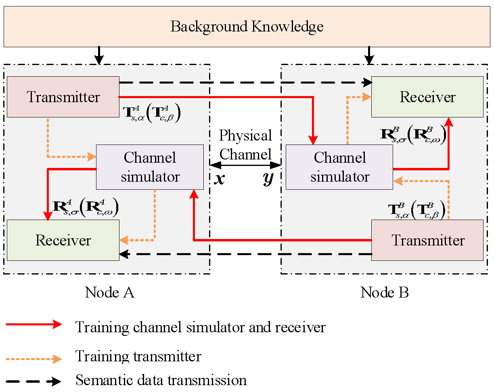
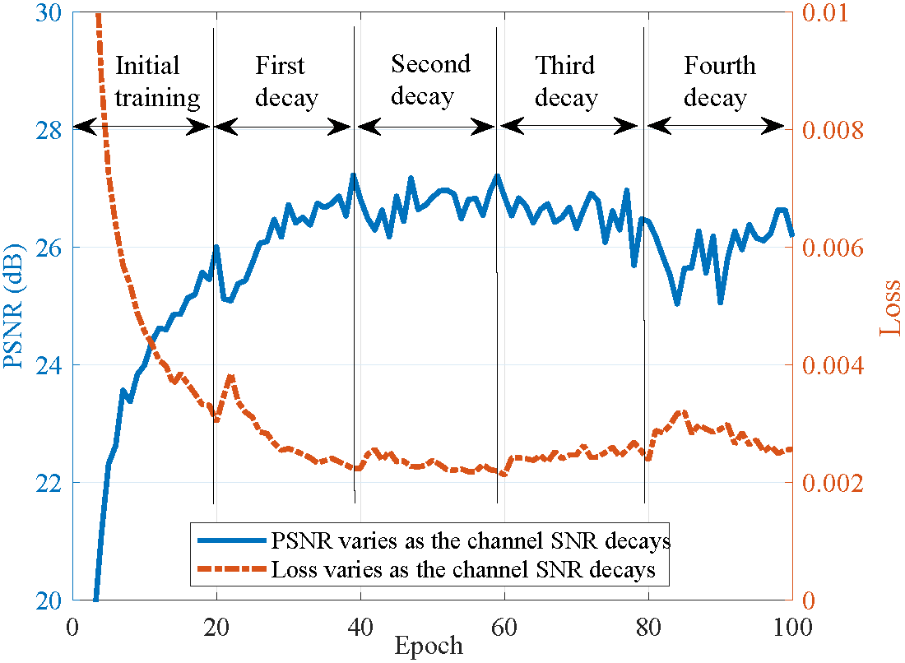

K. Yu, Q. He, and G. Wu, ``Two-way semantic communications without feedback,'' IEEE Trans. Veh. Technol., vol. 73, no. 6, pp. 9077–9082, June 2024.

If you find the code is useful for your research, please cite the aforementioned paper.


# Two-way semantic communications without feedbac

Tensorflow implementation of the [paper](https://ieeexplore.ieee.org/document/10400867) "Two-way semantic communications without feedback". 

# Introduction
Semantic communications can significantly improve transmission efficiency, especially in the low signal-to-noise (SNR) regime. However, two-way semantic communications still remain an unexplored topic, which is a critical issue in many machine communication scenarios. Simply extending existing semantic communication systems to the two-way situation requires bidirectional information feedback during the training process, resulting in significant communication overhead. To fill this gap, we investigate a two-way semantic communication (TW-SC) system, where the information feedback can be omitted by exploiting the weight reciprocity in the transceiver. Particularly, the channel simulator and semantic transceiver are implemented on both TW-SC nodes and the channel distribution is modeled by a conditional generative adversarial network. Simulation results demonstrate that the proposed TW-SC system performs closing to the state-of-the-art one-way semantic communication systems but requiring no feedback between the transceiver in training process.



>  Illustration of the structure of proposed TW-SC.


# Prerequites
* [Python 3.7]


# Quick Start

Install the environment and run the main.py function directly for training

# Experimental results


## The loss and PSNR performance of the proposed TW-SC system during channel SNR decay



# Citation

Please use the following BibTeX citation if you use this repository in your work:

```
@article{yu2024two,
  title={Two-way semantic communications without feedback},
  author={Yu, Kaiwen and He, Qi and Wu, Gang},
  journal={IEEE Transactions on Vehicular Technology},
  volume={73},
  number={6},
  pages={9077--9082},
  year={2024},
  publisher={IEEE}
}
```
